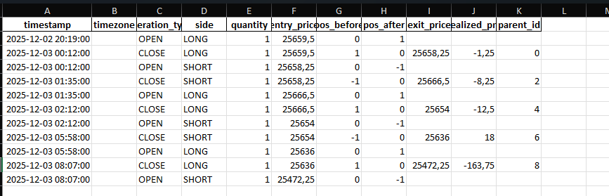

# 1. Introduction

InvestIQ-v1 est une infrastructure modulaire de backtesting en Python, conçue pour analyser et tester des stratégies systématiques. 

La version 1 propose un moteur fonctionnel complet (data, stratégie, exécution, journalisation), prêt à être utilisé ou étendu.

# 2. Structure du code

``` sql
src/
│
├── backtest_engine/          # moteur de simulation
├── strategy_engine/          # interface stratégie + exemple
├── historical_data_engine/   # récup. données historiques
├── export_engine/            # export résultats / métriques
├── config/                   # fichiers de configuration
├── utilities/                # outils généraux
└── Main.py                   # point d’entrée

```


# 3. Installation (Windows)

Ce guide permet d’installer et d’exécuter _InvestIQ-v1_ dans un environnement isolé et reproductible.

## 3.1 Cloner le dépôt

Ouvrir PowerShell puis exécuter :

``` powershell
git clone https://github.com/ManuelBayon/InvestIQ-v1.git
cd InvestIQ-v1
```

---
## 3.2 Créer un environnement virtuel

Créer un environnement dédié dans le dossier `InvestIQ-v1` :

``` powershell
python -m venv .venv
```

---
## 3.3 Activer l'environnement virtuel

``` powershell
.venv\Scripts\Activate.ps1
```

La ligne de commande doit afficher un préfixe `(.venv)`, par exemple :

``` powershell
(.venv) PS C:\Users\Manuel\Documents\...\src>
```

---
## 3.4 Installer les dépendances

``` powershell
pip install -r requirements.txt
```

---
# 4. Configuration Interactive Brokers (TWS)

Cette section explique comment installer et configurer **Trader Workstation (TWS)** pour permettre à InvestIQ-v1 de communiquer avec Interactive Brokers (en mode simulé ou réel).

## 4.1. Pourquoi une configuration TWS propre ?

TWS mélange dans le même dossier :

- les exécutables (`tws.exe`, `ibgateway.exe`)
- **les paramètres utilisateurs** (`jts.ini`, fichiers XML, caches)
- les logs

Pour éviter les conflits, assurer la reproductibilité et permettre à InvestIQ-v1 de charger une configuration propre, **il est recommandé d’installer TWS dans un dossier dédié**, différent du dossier `C:\Jts` (qui est le dossier de configuration utilisé par IB par défaut).

## 4.2 Installation de TWS (Trader WorkStation)

### Étape 1 - Télécharger TWS

Télécharger TarderWorkstation (TWS) sur le site officiel d’Interactive Brokers :

👉 https://www.interactivebrokers.ie/en/trading/trading-platforms.php

Deux versions existent :

- **TWS (recommandé)**
- **TWS Latest** (plus fréquent en mise à jour)

### Étape 2 - Créer un dossier d'installation propre

⚠️ **Attention — par défaut, l’installateur de TWS choisit le dossier `C:\Jts`.**

1. Créer un dossier `C:\TWS`
2. Lors de l’installation, sélectionner ce dossier comme destination.


---
## 4.3 Première connexion (Trading Simulé)

1. Lancer **TWS**
2. Se connecter en **Trading Simulé**  
3. Attendre que l’interface se charge complètement


---
## 4.4. Configuration API requise

Dans TWS pour trouver les paramètres de l'API suivre les instructions suivantes :

- **Fichier** → _Configuration Générale_
- **API** → _Settings_

1. Cocher : **Enable ActiveX and Socket Clients**
2. Décocher : **Read-Only API**
3. Vérifier le port : **7497** (compte simulé)


⚠️ **Ne PAS fermer TWS**

---


# 5. Création d’une stratégie personnalisée

Pour créer une nouvelle stratégie dans **InvestIQ-v1**, rendez-vous dans :
```powershell
./src/strategy_engine/
```

Vous y trouverez la classe abstraite `AbstractBaseStrategy`, qui définit l’interface que toutes les stratégies doivent respecter.

Une stratégie doit **hériter** de `AbstractBaseStrategy` et **implémenter** la méthode suivante :
```powershell
generate_signals(self, data: pd.DataFrame) -> pd.DataFrame
```

Cette méthode reçoit les données de marché (OHLC + timestamp) et doit retourner un `DataFrame` contenant au minimum :

- `timestamp`
- `close` (ou autre prix utilisé)
- `target_position` (position cible souhaitée, utilisée par le moteur FIFO)

---
## 5.1 Exemple complet pas à pas

### Étape 1 — Créer un fichier `exemple.py`

Dans :
``` powershell
./src/strategy_engine
```

Créer un fichier nommé comme vous le souhaitez, par exemple :
``` powershell
exemple.py
```

---
### Étape 2 : Créer la classe de stratégie

Voici le squelette minimal d'une stratégie :

```python
from strategy_engine.abstract_strategy import AbstractBaseStrategy
import pandas as pd


class MaStrategie(AbstractBaseStrategy):

    def __init__(
        self,
        param_1: int,
        param_2: float = 0.025
    ):
        """
        Exemple d'initialisation de paramètres de stratégie.
        param_1 : entier (ex : période courte)
        param_2 : flottant (ex : seuil)
        """
        self.param_1 = param_1
        self.param_2 = param_2
```

---
### Étape 3 : Implémenter la méthode `generate_signals`

La signature **doit être strictement** : 

```python
def generate_signals(self, data: pd.DataFrame) -> pd.DataFrame:
```

Et vous devez retourner un `DataFrame` contenant **au minimum** :

```python
["timestamp", "close", "target_position"]
```

> [!NOTE]
Le moteur utilise par défaut `close` pour le calcul du PnL.  
Voir ci-dessous pour changer le type de prix.

---

### Étape 3 (bis): Modifier le type de prix utilisé pour le PnL

Pour utiliser `open`, `high`, `low` ou tout autre prix :

1. Aller dans :
``` powershell
./src/backtest_engine/portfolio/portfolio.py
```

2. Trouver la méthode `generate_and_apply_fifo_operations_from_signals`

3. Modifier :

```python
price = row.close
```

en : 
``` python
price = row.open  # ou row.high / row.low
```

---
### Étape 4 : Exemple final : stratégie `BollingerMeanReversion`

Objectif :  
- Acheter quand le prix touche la bande basse.  
-  Vendre quand il touche la bande haute.  
-  Rester neutre au milieu.

```python
from strategy_engine.abstract_strategy import AbstractBaseStrategy
import pandas as pd


class BollingerMeanReversionStrategy(AbstractBaseStrategy):

    def __init__(
        self,
        window: int = 20,
        num_std: float = 2.0
    ):
        """
        Stratégie de retour à la moyenne basée sur les bandes de Bollinger.
        - window  : taille de la fenêtre mobile
        - num_std : nombre d'écarts-types pour les bandes
        """
        self.window = window
        self.num_std = num_std

    def generate_signals(self, data: pd.DataFrame) -> pd.DataFrame:
        df = data.copy()

        # Bande centrale : moyenne mobile
        df["middle"] = df["close"].rolling(self.window).mean()

        # Écart-type
        df["std"] = df["close"].rolling(self.window).std()

        # Bandes de Bollinger
        df["upper"] = df["middle"] + self.num_std * df["std"]
        df["lower"] = df["middle"] - self.num_std * df["std"]

        # Initialisation de la position cible
        df["target_position"] = 0

        # Règles :
        df.loc[df["close"] < df["lower"], "target_position"] = +1   # acheter
        df.loc[df["close"] > df["upper"], "target_position"] = -1   # vendre

        # Retour au format attendu
        return df[["timestamp", "close", "target_position"]]
```

# 6. Démarrage rapide (Quick Start)

## 5.1 Lancement de l'application 

Aller dans  le répertoire `src` du projet `InvestIQ-v1`et exécuter la commande suivante:

``` powershell
python Main.py
```

Le moteur va :

- initialiser les moteurs (backtest, data, export),
- se connecter à Interactive Brokers (simulé ou réel selon configuration),
- exécuter la stratégie par défaut,
- produire un fichier Excel dans `InvestIQ-v1\Backtest Logs\output.xlsx` dans lequel sont répertorié l'ensemble des positions exécutés par la stratégie.
- produire un fichier de logs pour l'ensemble des moteurs du projet dans `InvestIQ-v1\Engine Logs\output.log`

## 5.2 Exemple d'utilisation

Logs console : 


Résultats Excel des positions prises en fonction de la stratégie et de la configuration du moteur :



---

# 7. Licence / disclaimers

- Ce projet est fourni à des fins éducatives. 
- Aucune garantie n’est donnée pour l’utilisation en trading réel.